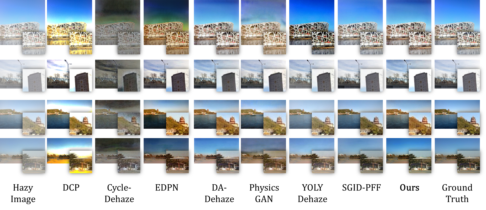

# 
 A New Approach for Training a Physics-Based Dehazing Network Using Synthetic Images
### 
In Signal Processing - Elsevier
### 
Neil Patrick Del Gallego, Joel Ilao, Macario Cordel II, Conrado Ruiz Jr.

### 
De La Salle University, Grup de Recerca en Tecnologies Media, La Salle - Universitat Ramon Llull

# DISCLAIMER
**The source code is currently still in pre-deployment stage. Please stay tuned for the production and test-ready source code.**

 

### <strong>Paper (to appear in Signal Processing - Elsevier) | Source code (coming soon) | Pretrained model (coming soon) </strong>

### Abstract

 In this study, we propose a new approach for training a physics-based dehazing network, using RGB images and depth maps gathered from a 3D urban virtual environment, with simulated global illumination and physically-based shaded materials. Since 3D scenes are rendered with depth buffers, full image depth can be extracted based on this information, using a custom shader, unlike
the extraction of real-world depth maps, which tend to be sparse. Our proposed physics-based dehazing network uses generated transmission and atmospheric maps from RGB images and depth maps from the virtual environment. To make our network compatible with real-world images, we incorporate a novel strategy of using unlit image priors during training, which can also be extracted
from the virtual environment. We formulate the training as a supervised image-to-image translation task, using our own DLSU-SYNSIDE (SYNthetic Single Image Dehazing Dataset), which consists of clear images, unlit image priors, transmission, and atmospheric maps. 

 Our approach makes training stable and easier as compared to unsupervised approaches. Experimental results demonstrate the competitiveness of our approach against state-of-the-art dehazing works, using known benchmarking datasets such as I-Haze, O-Haze, and RESIDE, without our network seeing any real-world images during training. 

### Directory for High-Resolution Image Results

<a href="https://github.com/NeilDG/SynthDehazing/tree/gh-pages/web_img/">Figures in paper</a>  
<a href="https://github.com/NeilDG/SynthDehazing/tree/production-workspace/output/dehazed/I-Haze">I-Haze Dehazed Results </a>  
<a href="https://github.com/NeilDG/SynthDehazing/tree/production-workspace/output/dehazed/O-Haze">O-Haze Dehazed Results </a>  
<a href="https://github.com/NeilDG/SynthDehazing/tree/production-workspace/output/dehazed/RESIDE-OTS">RESIDE-OTS Dehazed Results </a>  
  
### DLSU-SYNSIDE (SYNthetic Single Dehazing Dataset)
The training images used in our paper, will be released soon.
  
### DLSU-SYNSIDE Pre-Trained Models
Pre-trained models include the style transfer network, unlit network, airlight and transmission estimators, as described in the paper.  
Link: <a href="https://drive.google.com/file/d/11HqA6xYMfrNRmNZOtN0S6jhZVWwa8roz/view?usp=sharing">Pre-trained models </a>

 
Assuming you have the source project, place all models in <b>"./checkpoint" <b> directory.
  
### Running the code
<TODO>
  
### Citation
Coming Soon

### Acknowledgements
We would like to acknowledge De La Salle University (DLSU), Department of Science and Technology (DOST), and the Google Cloud Research program, for funding this research.
